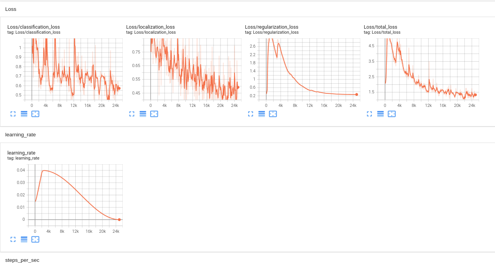
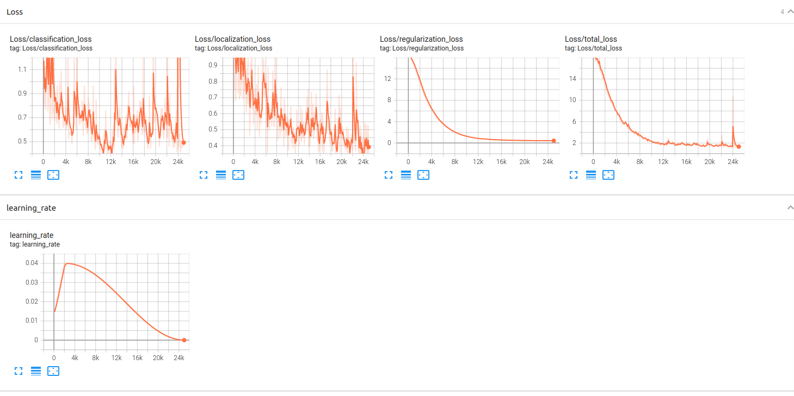
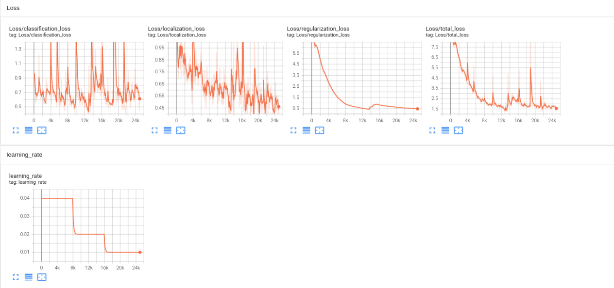
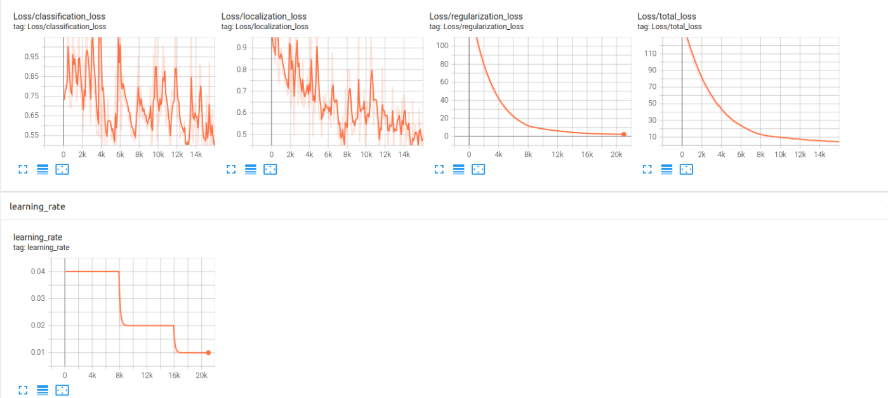
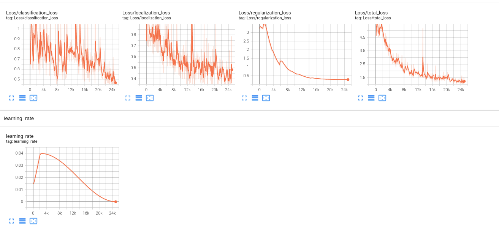
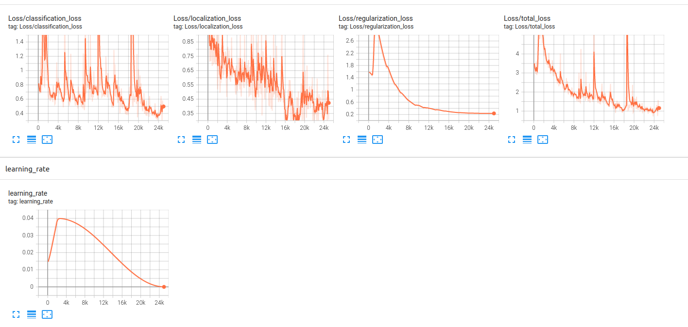
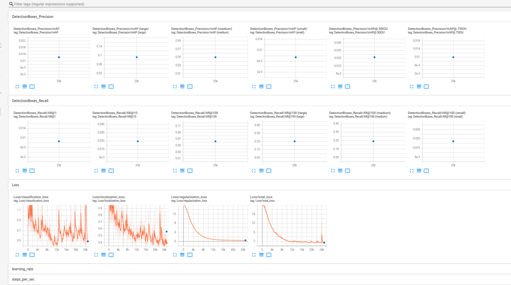

# Object Detection in an Urban Environment

## Structure

### Data
```
/app/project/data/waymo
    - training_and_validation - contains 97 files to train and validate your models
    - train: contain the train data (empty to start)
    - val: contain the val data (empty to start)
    - test - contains 3 files to test your model and create inference videos
```

The `training_and_validation` folder contains file that have been downsampled: we have selected one every 10 frames from 10 fps videos. The `testing` folder contains frames from the 10 fps video without downsampling.

### Experiments
The experiments folder will be organized as follow:
```
experiments/
    - pretrained_model/
    - exporter_main_v2.py - to create an inference model
    - model_main_tf2.py - to launch training
    - reference/ - reference training with the unchanged config file
    - experiment0/ - create a new folder for each experiment you run
    - experiment1/ - create a new folder for each experiment you run
    - experiment2/ - create a new folder for each experiment you run
    - label_map.pbtxt
    ...
```

### Local Setup

Nvidia GPU required, you can use the provided Dockerfile and requirements in the [docker directory](./docker).

Follow [the README therein](./docker/README.md) to create a docker container and install all prerequisites.


## download pretrained model
As we explain during the course, the Tf Object Detection API relies on **config files**. The config that we will use for this project is `pipeline.config`, which is the config for a SSD Resnet 50 640x640 model. You can learn more about the Single Shot Detector [here](https://arxiv.org/pdf/1512.02325.pdf).

First, let's download the [pretrained model](http://download.tensorflow.org/models/object_detection/tf2/20200711/ssd_resnet50_v1_fpn_640x640_coco17_tpu-8.tar.gz) and move it to `/home/workspace/experiments/pretrained_model/`.
```
mkdir -p /app/project/experiments/pretrained_model/
cd /app/project/experiments/pretrained_model/
wget http://download.tensorflow.org/models/object_detection/tf2/20200711/ssd_resnet50_v1_fpn_640x640_coco17_tpu-8.tar.gz
tar -xvzf ssd_resnet50_v1_fpn_640x640_coco17_tpu-8.tar.gz
rm -rf ssd_resnet50_v1_fpn_640x640_coco17_tpu-8.tar.gz 
```

## edit config file
We need to edit the config files to change the location of the training and validation files, as well as the location of the label_map file, pretrained weights. We also need to adjust the batch size. A new config file has been created, `pipeline_new.config`. To do so, run the following:
```
python edit_config.py --train_dir /app/project/data/train/ --eval_dir /app/project/data/val --batch_size 2 --checkpoint /app/project/experiments/pretrained_model/ssd_resnet50_v1_fpn_640x640_coco17_tpu-8/checkpoint/ckpt-0 --label_map /app/project/experiments/label_map.pbtxt
mkdir -p /app/project/experiments/reference/
mv pipeline_new.config experiments/reference/
```

## launch training process
You will now launch your very first experiment with the Tensorflow object detection API. Move the `pipeline_new.config` to the `/home/workspace/experiments/reference` folder. Now launch the training process:
```
python experiments/model_main_tf2.py --model_dir=experiments/reference/ --pipeline_config_path=experiments/reference/pipeline_new.config
```

## monitor training 
```
python -m tensorboard.main --logdir experiments/reference/
```
## launch evaulation
Once the training is finished, launch the evaluation process:
```
python experiments/model_main_tf2.py --model_dir=experiments/reference/ --pipeline_config_path=experiments/reference/pipeline_new.config --checkpoint_dir=experiments/reference/
```

**Note**: Both processes will display some Tensorflow warnings, which can be ignored. You may have to kill the evaluation script manually using
`CTRL+C`.

To monitor the training, you can launch a tensorboard instance by running `python -m tensorboard.main --logdir experiments/reference/`. You will report your findings in the writeup.

### Improve the performances

(https://github.com/tensorflow/models/blob/master/research/object_detection/protos/preprocessor.proto) file contains the different data augmentation method available in the Tf Object Detection API. To help you visualize these augmentations, we are providing a notebook: `Explore augmentations.ipynb`. Using this notebook, try different data augmentation combinations and select the one you think is optimal for our dataset. Justify your choices in the writeup.

Keep in mind that the following are also available:
* experiment with the optimizer: type of optimizer, learning rate, scheduler etc
* experiment with the architecture. The Tf Object Detection API [model zoo](https://github.com/tensorflow/models/blob/master/research/object_detection/g3doc/tf2_detection_zoo.md) offers many architectures. Keep in mind that the `pipeline.config` file is unique for each architecture and you will have to edit it.

**Important:** If you are working on the workspace, your storage is limited. You may to delete the checkpoints files after each experiment. You should however keep the `tf.events` files located in the `train` and `eval` folder of your experiments. You can also keep the `saved_model` folder to create your videos.

redo process for another experient

copy file pipeline<x>_config to pipeline_config.txt where <x> is the experiment number
```
python edit_config.py --train_dir /app/project/data/train/ --eval_dir /app/project/data/val --batch_size 2 --checkpoint /app/project/experiments/pretrained_model/ssd_resnet50_v1_fpn_640x640_coco17_tpu-8/checkpoint/ckpt-0 --label_map /app/project/experiments/label_map.pbtxt
mkdir -p /app/project/experiments/experiment0/
mv pipeline_new.config experiments/experiment0/
python experiments/model_main_tf2.py --model_dir=experiments/experiment0/ --pipeline_config_path=experiments/experiment0/pipeline_new.config
```

## export model
```
python experiments/exporter_main_v2.py --input_type image_tensor --pipeline_config_path experiments/reference/pipeline_new.config --trained_checkpoint_dir experiments/reference/ --output_directory experiments/reference/exported/
```

Finally, you can create a video of your model's inferences for any tf record file. To do so, run the following command (modify it to your files):


## Create automation
```
python inference_video.py --labelmap_path label_map.pbtxt --model_path experiments/reference/exported/saved_model --tf_record_path data/test/segment-12200383401366682847_2552_140_2572_140_with_camera_labels.tfrecord --config_path experiments/reference/pipeline_new.config --output_path animation.gif
```

### Project overview
This project shows how to build a nueral network from scratch to operate in a dense urban enviroment. We saw using tensorboard the metrics used for training were working such that the losses were approaching a small number << 1. Although were trained the nueral network from scratch we did get assistance from the waymo dataset which saved us a lot of time annotating the data.

Object detection is an important concept for self-driving cars because cars, like humans, need to have situational awareness, they must know the difference between a cloud of fog vs a human wearing light clothes or a white colored vehicle.


#### Dataset analysis
By analyzing the data in the first notebook, we saw some vehicles were not annotated which is concerning. We were able to gather statistics on the number of objects present in the images for each class of object.

#### Cross validation
The training process included validation which ensured our training doesn't overfit. Using Tensorflow we saw the validation and training loss both decreasing and approaching a small number which is a good sign we have the right model complexitiy and the right data for the training process.

#### Reference experiment
The refence experiment ended with loss of about 0.2667 and 0.4338 for the first and second trails, it had an asymtotic shape which is what we would expect from proper training. Initially there was a lot of variance in the metrics as observed in tensorflow but overtime, as more batches are being processed, we are able to extract clean filtered curves where we can see the patterns we are looking for. The algorithm performed well and included a cosine-decreasing learning rate as the training process progressed.

#### Improve on the reference
The two experiments we wish to report are the changes to the learning rate and the scaling augmentation added. The pipeline_config.txt was modified to pipeline_experiment0 and pipeline_experiment1. Replacing the learning rate to a stair-step as opposed to the cosine-decreasing shape made slight improvements, however since the results are not easily reproducible the benefits weren't realized in every trial. The scaling augmentation (from 80% to 100%) proved to improve the training across the two pairs of trials.

| Experiment  | Description | Trail one | Trial two |
| ------------- | ------------- | ------------- | ------------- | 
| Reference  | Reference  | 0.2667  | 0.4388  |
| Experiment0  | Change learning rate to step function  | 0.4797  | 1.78  |
| Experiment1  | Added scaling augmentation  | 0.2742  | 0.2354  |


#### Reference Trail 1

    
#### Reference Trail 2


#### Change learning rate to step function Trail 1


#### Change learning rate to step function Trail 2


#### Added scaling augmentation trial 1


#### Added scaling augmentation trail 2


## Precision

   
